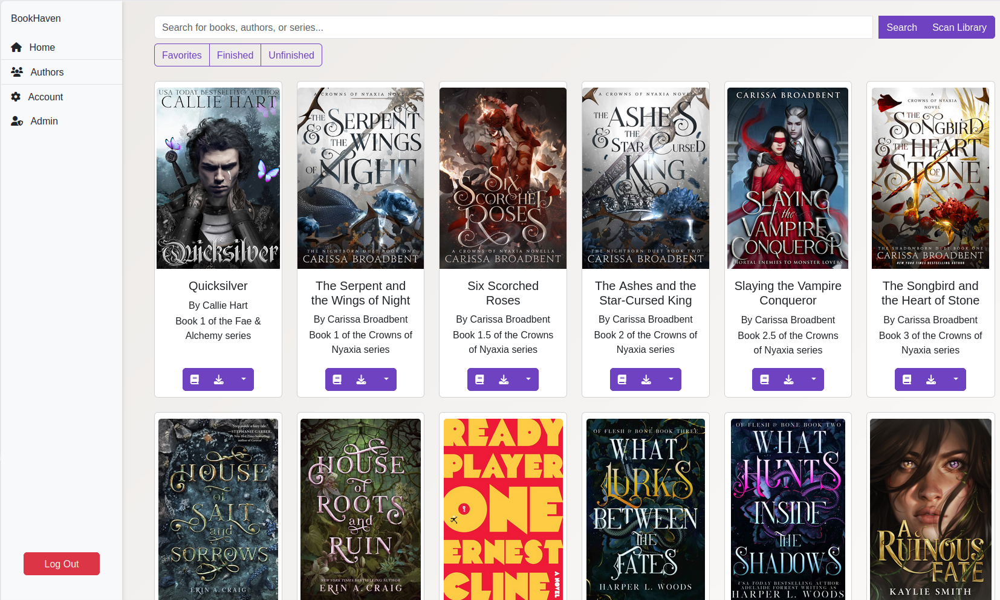

# BookHaven



## Table of Contents
1. [What the Application Does]()
2. [Features]()
3. [Deployment]()
   - [Docker]()
   - [Local]()
   - [Development]()

4. [Building the Application]()


## What the Application Does
BookHaven scans and manages your local library of EPUB ebooks, and allows you to read and download your ebooks on any of your devices, with a sleek, modern, and responsive interface.

## Features
- **Read eBooks in the Browser**
  Users can access and read their EPUB-formatted eBooks directly without any additional software.
- **Download eBooks**
  Easily download a copy of any eBook in the collection to your device.
- **Non-Destructive Metadata Editing**
  Changes to eBook metadata (e.g., title, author, series) are stored in the database, leaving the original EPUB files untouched.
- **Automatic or Manual Library Scanning**
  Once deployed the app will periodically, on a configurable interval, scan your library for any changes, while also allowing for manual library scans.
- **Home Page with Alphabetical Sorting**
  Books are sorted first alphabetically by their author and then by series, offering a clean and intuitive browsing experience.
- **Powerful Search**
  The search feature on the home page allows users to filter their library by author, book title, or series, helping locate specific content quickly.
- **Filters**
  Basic filters are made available to allow filtering for books marked as favorite, as finished, or books that haven't been marked as finished.
- **Author Page with Intuitive Navigation**
  A dedicated author page organizes authors into a clickable alphabetical grid. Users can click on a letter to expand its list of authors, navigate to an author's page, and view their books sorted alphabetically by series and standalone titles.
- **Supports CloudFlare Access**
  Has a flag to bypass the login screen when making use of CloudFlare Access. See `.env.example` for details.
- **OIDC Support**
  Allows for the configuration of OIDC for new user registration, and for existing users.
- **OPDS Support**
  Use your favorite OPDS-compatible e-reader or app to browse, download, and read books from your library.

## Requirements

At a minimum to run the application you require:

- A database (MySQL, SQLite, PostgreSQL)
- A Redis instance

For quick and easy deployment the .compose.yml.example defines both of these already.

## Docker
Follow these steps to deploy the application with Docker Compose:

**Download Configuration Files**

Download or clone the repository to get `compose.yml.example` and `.env.example`.

**Rename the Example Files**

``` bash
   mv compose.yml.example compose.yml
   mv .env.example .env
```

**Customize the `.env` File**

Edit `.env` to configure essential settings.

**Start the Application**

Run the following command:
``` bash
   docker compose up -d
```
This starts the `BookHaven`, Redis, and MySQL containers.

**Access the Application**

Open your browser and navigate to the `BASE_URL`:`APP_PORT` you configured (default is `http://localhost:5000`).

**Stopping the Application**

``` bash
   docker compose down
```

## Development
Follow these steps to deploy for development:

**Clone the repository**:

``` bash
   git clone https://github.com/HrBingR/BookHaven.git
   cd BookHaven
```

**Rename the example files**:

```bash
   mv compose.exmaple.yml compose.yml
   mv .env.example .env
```

**Customize the `.env` file**:

Edit `.env` to configure essential settings.

**Modify the `compose.yml` file**:

Change:

```yaml
    epub-reader:
       image: hrbingr/bookhaven:latest
```

To:

```yaml
  epub-reader:
     build:
        context: .
        dockerfile: Dockerfile
```

**Build the container**:
```bash
   docker compose up --build -d
```

**Access the app**:

Access the app on the `BASE_URL` and `APP_PORT` defined in the `.env` file.

## Building the Application
To build the application for production:

**Build the Frontend**:

``` bash
   cd frontend
   npm run build:dev
```

**Build the Docker Image**:

In the root project directory (BookHaven), run:
``` bash
   docker build -t tag:version .
```

Replace `tag:version` with your preferred image name and version (e.g., `bookhaven:1.0.0`).

## Change log:

- v1.0.x - Initial Release
- v1.1.0 - Added OIDC support
- v1.1.1 - Fixed a bug where OIDC front-end components would still render with OIDC disabled.
- v1.2.0 - Added support for optionally writing metadata to the ePub file, instead of just to the database.
- v1.2.1 - Fixed issue where Celery would detect PERIODIC_SCAN_INTERVAL, if explicitly defined, as a string and throw an exception.
- v1.2.2 - Fixed migration and DB model logic that would prevent Postgres users from successfully initializing the database.
- v1.3.0 - Added rudimentary OPDS support.
- v1.3.1 - Improved OPDS functionality.
- v1.3.2 - Fixed UI issues on Authors page, fixed some UX issues related to scrolling on Home page, improved cover image loading, upped default API rate limit and made it customizable.
- v1.3.3 - Implemented locking for the scan process to ensure only one scan runs at a time, and improved DB scan processing logic.

## TODO:

- Fix scan logic to ensure initial library scan on first startup
- Update tests with latest additions
- Explore support for other formats
- Explore adding more metadata fields for editing
- Add support for uploading books via the front-end
- Add more fine-grained permissions related to editing metadata and uploads, once in place